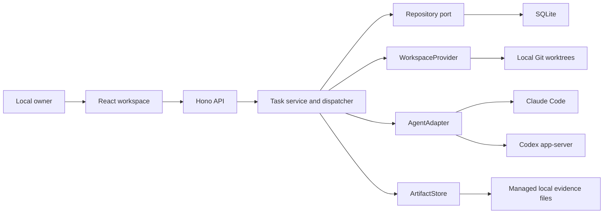

# Muon implementation architecture

This document describes the shipped initial implementation. The Linear product study is the broader product specification, including deliberately deferred behavior.

## System shape

The domain contracts live in `src/shared/domain.ts`. HTTP clients see the same task records in list, board, detail, attention, and chief task links. No provider protocol frame is sent to React.

## Task and approval model

Task status expresses the user's lifecycle: `backlog`, `todo`, `in_progress`, `in_review`, `blocked`, `done`, `canceled`. Phase expresses the mandatory agent workflow: `idle`, `planning`, `plan_review`, `building`, `verification`, `complete`.

An approved task waiting for capacity is `todo + building`. Building completion is `todo + verification`. Review is `in_review + plan_review`. These distinctions prevent a queued phase from being confused with an active process.

Every task has a UUID, a project-local readable identifier, workspace/project scope, immutable owner, kind (`coding` or `group`), provider, priority, labels, optional parent, and blocking dependencies. Omitted kind in existing records means coding. General coding-task edits are allowed before execution; group metadata and child membership remain editable. Canceled tasks may be detached from a parent while retaining their state and results. The API never permits a caller to set `done`, `in_progress`, plans, owner, or run IDs directly.

Groups are organizational containers. Reconciliation walks nested groups and dependencies, completes only a nonempty all-Done set, and reopens a completed group when new unfinished children appear. Groups never dispatch agents, fabricate RFC approval, or generate test evidence. A coding parent still executes its own RFC/build/verification lifecycle after its children finish. Dependency results and immutable change snapshots are supplied to integration tasks; their implementations are not automatically merged.

Plans preserve their content and version. A review updates decision metadata on that revision; it does not overwrite the document. Approval checks the fixed local actor against the owner, requires the latest pending revision ID, and uses optimistic task versioning. An agent cannot authorize implementation by emitting an approved status. Feedback creates a new planning attempt and later a fresh pending revision.

Run records capture each coding attempt's phase, provider, start/end, session ID, result status, and associated plan. Evidence records carry the verification run ID so the UI can separate current results from historical failures. Tasks retain earlier RFCs, evidence, final summaries, and milestones. Task cancellation invalidates the active run ID before a late result can be applied; retained changed files are refreshed after the process stops.

Recovery is explicit and persisted: retry repeats the failed phase; fix sends approved build/verification failures back to building with failure evidence and owner feedback; replan revokes the earlier approval and generates a fresh RFC requiring another owner decision. Recovery starts a fresh provider session in the retained worktree. Feedback never authorizes expanding an approved RFC.

## Dispatch and lifecycle

`TaskService` implements the `Dispatcher` contract. A local timer invokes `tick`; ticks are serialized. A repository must be configured before coding work can dispatch. Eligible work is Todo, unclaimed, has all blocking dependencies Done, and has no unfinished children. Priority 1 is most urgent; unset priority sorts last. Approval is checked again before claiming build or verification.

Claiming is a compare-and-swap task revision update. Active capacity is reserved before asynchronous execution and includes the chief. Review releases capacity; approved builds and verification reenter the queue. Pausing prevents new coding launches while already-running work finishes. An explicit chief request can run while coding dispatch is paused, within the same total capacity.

The local instance lock prevents a second process from dispatching the same data directory even on another HTTP port. Graceful shutdown waits for in-progress claims and provider cleanup. Failed cleanup retains its slot. Startup marks interrupted tasks Blocked, pauses dispatch for process inspection, reconstructs attention, and reports an interrupted chief request rather than replaying potentially partially-applied commands.

This is a single-coordinator implementation. Distributed lease heartbeats and a durable message queue are not implemented. A cloud dispatcher must supply distributed admission, worker reconciliation, and leases behind the Dispatcher boundary; using the SQLite implementation unchanged from multiple hosts would be incorrect.

## Chief of staff

The chief calls the same `ClaudeCodeAdapter.run` contract with phase `chief`, read-only project access, task context, and recent final conversation. Its final JSON is schema-validated before mutations. It creates coding tasks and groups, edits eligible task metadata and relations, queues and prioritizes work, cancels tasks, and requests retry/fix/replan recovery. References such as `@feature` let later actions attach children, dependencies, and updates to tasks created earlier in the same result. Its default decomposition creates a group plus independently reviewed coding subtasks; final integration, when needed, is a separate dependent coding task.

Applying a result pauses new dispatch selection until the action batch ends so a new parent cannot start before its children are attached. Each action goes through task domain validation. Successful task IDs and failed action explanations accompany the final response. Actions are individually persisted, not one all-or-nothing transaction. Crash recovery does not replay an unfinished chief batch.

Submission atomically persists the user message and claims the single pending chief request, preventing concurrent requests from overwriting one another. The chief uses existing messages as context; it starts a fresh provider session per request in this version. It cannot approve plans, fabricate completion state, or edit the database directly through its available tools.

## Replaceable subsystems

| Contract | Current implementation | Cloud implementation |
| --- | --- | --- |
| `Repository` | `SqliteRepository`, driver kept in one module | PostgreSQL repository preserving scoped queries, optimistic versions, atomic ID allocation and chief enqueue |
| `AgentAdapter` | `ClaudeCodeAdapter`, `CodexAdapter` | Worker RPC adapter with the same request/result and cancellation contract |
| `WorkspaceProvider` | `LocalWorktreeProvider` | Remote checkout/container provider; return worker-local workspace references |
| `ArtifactStore` | `LocalArtifactStore` | Object storage with authorized asset delivery |
| `IdentityProvider` | `LocalIdentityProvider` | Request identity/session and project membership provider |
| `Dispatcher` | In-process task service scheduler | Durable queue and distributed coordinator |

Composition is confined to `src/server/index.ts`. The default fixed scope is supplied there rather than accepted from HTTP request bodies. A future authenticated HTTP layer must resolve scope per request, authorize project membership, and route to the appropriate coordinator. The domain already separates owner and delegated provider and validates RFC owner authority.

The repository stores task aggregates in JSON payloads with relational scope, identity, status, priority, and version columns for keys and indexes. Replacing SQLite with PostgreSQL can preserve the port and use JSONB; it still requires migrations, transactional equivalence, and operational work. This version uses schema version 1, not a complete multi-version migration framework.

The UI polls the `/api/state` read model every two seconds. Push delivery/outbox and external notifications are deferred. Attention is a durable repository record, so replacing delivery does not change approval state. Project completion is reconciled when all tasks are Done/Canceled with at least one verified coding result; the notice distinguishes verified tasks, completed groups, and canceled work, remains acknowledged after reading, and clears when new work is added.

## Evidence and workspace boundaries

Muon creates one branch/worktree per coding task, records its original base commit, and revalidates repository, path, and branch identity before every phase. Both providers receive that workspace. Changed files are computed using Git against the recorded base, including committed, staged, unstaged, and untracked changes. Renames are represented as additions/deletions in this initial adapter. No automatic merging or removal is performed.

`WorkspaceProvider.exportChanges` supplies completed dependency inputs as bounded Git patches, including binary files and untracked additions. The local exporter validates ownership and consistency, uses a private temporary Git index/object store, and leaves the source checkout and index untouched. Group prerequisites expand to completed coding leaves. Each RFC persists the exact snapshots and SHA-256 identities used during planning; building and verification reuse that approved set instead of reading mutable sibling worktrees. The owner can inspect input files and download exact patches in the Plan tab. Oversized or unsupported inputs fail explicitly (256 KiB per patch, 512 KiB combined) rather than silently dropping changes. No agent receives write access to a sibling worktree.

Repository setup validation is delegated to `WorkspaceProvider.validateRepository`. The local implementation requires an absolute Git root with a commit. HTTP handlers do not inspect repository files themselves. Agents inspect committed setup requirements during planning and perform dependency installation only after RFC approval, using their own worktree and local caches.

Verification requires structured evidence with concrete test steps and observed results. At least one test must pass, and any failed or skipped reported test blocks completion. Required RFC checks cannot be reclassified as notes to bypass this gate. Optional investigations that could not run are disclosed separately; earlier failed or skipped attempts remain in history after recovery. Muon validates the report shape but does not independently prove that an agent's textual report is true. Evidence should be reviewed alongside the recorded commands and Git changes. A future verifier can use the same agent/workspace interfaces with stronger evidence attestation.

Screenshots, recordings, and text attachments (TXT, LOG, Markdown, JSON, CSV) are copied from a task worktree into managed storage. Absolute paths, traversal, source symlink escapes, symlinked storage escapes, unsupported file types, and oversized files are rejected. An attachment failure retains the final summary, test steps/results, and any valid assets, adds explicit failure evidence, and blocks completion. Artifact reads are project-scoped. HTTP byte ranges support recording playback and seeking; the UI exposes full-size images and downloadable originals. The initial single-owner artifact store does not yet implement per-task ACLs or per-user recipients; those are required when adding multiple users.

Markdown is rendered without raw HTML execution. HTML RFCs use an isolated, script-disabled iframe. The main UI exposes final results only, while Claude/Codex may retain their own normal local histories outside Muon.

## What is deliberately not shipped

- Multi-project selection, memberships, authentication, collaborative editing, and cloud workers.
- Cycles, milestones, estimates, configurable workflows, rich comment threads, and external Linear synchronization.
- Diff editing, merging/publishing, automatic worktree cleanup, or a packaged desktop shell.
- Durable distributed leases, external push/email, full event sourcing, or independently attested test execution.

These are explicit extension points rather than UI controls that pretend to work. The implemented loop is local task creation → real provider planning → exact owner approval → isolated build → verification evidence → attention.
