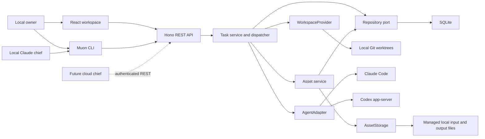

# Muon implementation architecture

This document describes the shipped initial implementation. The Linear product study is the broader product specification, including deliberately deferred behavior.

## System shape

The core records live in `src/shared/types.ts`, request schemas in `src/shared/api-contract.ts`, and the browser/CLI HTTP client in `src/shared/api-client.ts`. The server is the system of record; clients have no SQLite or TaskService dependency. The resource contract and command surface are documented in [REST API](rest-api.md) and [CLI](cli.md). HTTP clients see the same task records in list, board, detail, attention, and chief task links. No provider protocol frame is sent to React.

## Task and approval model

Task status expresses the user's lifecycle: `backlog`, `todo`, `in_progress`, `in_review`, `blocked`, `done`, `canceled`. Phase expresses the mandatory agent workflow: `idle`, `planning`, `plan_review`, `building`, `verification`, `complete`.

An approved task waiting for capacity is `todo + building`. Building completion is `todo + verification`. Review is `in_review + plan_review`. These distinctions prevent a queued phase from being confused with an active process.

Every task has a UUID, a project-local readable identifier, workspace/project scope, immutable owner, kind (`coding` or `group`), provider, priority, labels, optional parent, and blocking dependencies. Omitted kind in existing records means coding. General coding-task edits are allowed before execution; group metadata and child membership remain editable. Canceled tasks may be detached from a parent while retaining their state and results. The API never permits a caller to set `done`, `in_progress`, plans, owner, or run IDs directly.

Groups are organizational containers. Reconciliation walks nested groups and dependencies, completes only a nonempty all-Done set, and reopens a completed group when new unfinished children appear. Groups never dispatch agents, fabricate RFC approval, or generate test evidence. A coding parent still executes its own RFC/build/verification lifecycle after its children finish. Dependency results and immutable change snapshots are supplied to integration tasks; their implementations are not automatically merged.

Plans preserve their content and version. A review updates decision metadata on that revision; it does not overwrite the document. Approval checks the fixed local actor against the owner, requires the latest pending revision ID, and uses optimistic task versioning. An agent cannot authorize implementation by emitting an approved status. Each owner comment is a durable discussion message tied to the reviewed revision. It invalidates that pending review and queues a new planning attempt using the same provider session and worktree. The agent receives the complete discussion and latest RFC and returns a validated reply plus a complete revised RFC; these are saved atomically as an assistant message and a new pending revision. A malformed response blocks the task and retains the comment for retry. Comments and approval are rejected during revision, against old versions, or after approval. The REST discussion resource and CLI expose the same records as the UI.

General task comments are separate from RFC discussion and persist the owner message and interruption intent first. Client request UUIDs make repeated submissions idempotent. The service retains the interrupted run identity until process shutdown is confirmed, then delivers a read-only discussion turn using the retained provider session and worktree. Its final reply is saved as a task comment; interrupted work resumes its prior phase with comment context. Done and Blocked questions preserve their lifecycle and evidence. A scope-changing follow-up explicitly requests replanning and a new owner approval. Unstarted comments become initial planning context; groups and canceled tasks reject follow-ups. Failed delivery remains recoverable without deleting the conversation.

Run records capture each coding or discussion attempt's phase, provider, start/end, session ID, result status, and associated plan, including interrupted attempts. Evidence records carry the verification run ID so the UI can separate current results from historical failures. Tasks retain earlier RFCs, comments, evidence, final summaries, and milestones. Task cancellation invalidates the active run ID before a late result can be applied; retained changed files are refreshed after the process stops.

Recovery is explicit and persisted: retry repeats the failed phase; fix sends approved build/verification failures back to building with failure evidence and owner feedback; replan revokes the earlier approval and generates a fresh RFC requiring another owner decision. Recovery starts a fresh provider session in the retained worktree. Feedback never authorizes expanding an approved RFC.

## Dispatch and lifecycle

`TaskService` implements the `Dispatcher` contract. A local timer invokes `tick`; ticks are serialized. A repository must be configured before coding work can dispatch. Eligible work is Todo, unclaimed, has all blocking dependencies Done, and has no unfinished children. Priority 1 is most urgent; unset priority sorts last. Approval is checked again before claiming build or verification.

Claiming is a compare-and-swap task revision update. Active capacity is reserved before asynchronous execution and includes the chief. Review releases capacity; approved builds and verification reenter the queue. Pausing prevents new coding launches while already-running work finishes. An explicit chief request can run while coding dispatch is paused, within the same total capacity.

The local instance lock prevents a second process from dispatching the same data directory even on another HTTP port. Graceful shutdown waits for in-progress claims and provider cleanup. Failed cleanup retains its slot. Startup marks interrupted tasks Blocked, pauses dispatch for process inspection, reconstructs attention, and reports an interrupted chief request rather than replaying potentially partially-applied commands.

This is a single-coordinator implementation. Distributed lease heartbeats and a durable message queue are not implemented. A cloud dispatcher must supply distributed admission, worker reconciliation, and leases behind the Dispatcher boundary; using the SQLite implementation unchanged from multiple hosts would be incorrect.

## Chief of staff

The chief uses `ClaudeCodeAdapter.run` with phase `chief`, a read-only project, recent final conversation, and a per-run CLI capability. It reads current records and performs task operations through `muon` commands. Each command calls the REST API; normal application validation and persistence happen before the command returns. The final Markdown is display-only and cannot execute an action, even if it contains JSON.

`LocalChiefCommands` implements `ChiefCommandGateway` and the HTTP authorization/observation hook. It issues a short-lived scoped bearer credential and a read-only temporary executable that pins the API origin and credential. Caller environment overrides cannot turn that executable into an owner client. The Claude Bash allowlist permits the supplied executable, keeps source writes denied, and allows only the loopback API host/port through the required sandbox. The CLI honors the sandbox HTTP proxy. Other commands, unsandboxed retries, hooks, and MCP tools are unavailable.

The API grants the chief task reads, creation, eligible edits, cancellation, and recovery. It rejects RFC approvals, owner review feedback, settings, attention acknowledgements, and recursive chief requests. Unknown, expired, and canceled tokens never fall back to owner authority. The local owner UI/CLI still trusts loopback access on this machine; this is not a hostile-process or multiuser isolation boundary. Cloud hosting must supply authenticated identities, membership checks, request-specific scopes, and its deployment boundary.

Successful REST mutations journal affected task IDs for links in the chief's final reply. A request admitted before revocation can finish and is still recorded; subsequent requests are rejected. Applied changes survive an agent failure or interrupted final reply. There is no hidden action batch and no replay of partially completed work. For decomposition, the chief creates linked Backlog tasks first, then queues them, because the dispatcher can pick up Todo work immediately.

Submission atomically persists the user message and claims one pending chief request. Chief runs share the coding concurrency limit and start fresh provider sessions. Cancellation and shutdown revoke credentials, clean up the temporary launcher, and preserve already saved records. The server rechecks shutdown after asynchronously creating the command session, before launching a provider.

## Replaceable subsystems

| Contract | Current implementation | Cloud implementation |
| --- | --- | --- |
| `Repository` | `SqliteRepository`, driver kept in one module | PostgreSQL repository preserving scoped queries, optimistic versions, atomic ID allocation and chief enqueue |
| `AgentAdapter` | `ClaudeCodeAdapter`, `CodexAdapter` | Worker RPC adapter with the same request/result and cancellation contract |
| `WorkspaceProvider` | `LocalWorktreeProvider` | Remote checkout/container provider; return worker-local workspace references |
| `AssetStorage` | `LocalAssetStorage`; metadata is persisted through `Repository` | GCS or another object store with the same byte-storage contract and authorized asset delivery |
| `IdentityProvider` | `LocalIdentityProvider` | Request identity/session and project membership provider |
| `ChiefCommandGateway` | Scoped per-run local CLI executable and credential | Remote worker capability issuance using the same REST resource contract |
| `HttpRequestAccess` | Local chief capability policy with trusted loopback owner | Authenticated request authorization and mutation observation |
| `Dispatcher` | In-process task service scheduler | Durable queue and distributed coordinator |

Composition is confined to `src/server/index.ts`. The default fixed scope is supplied there rather than accepted from HTTP request bodies. A future authenticated HTTP layer must resolve scope per request, authorize project membership, and route to the appropriate coordinator. The application already separates owner and delegated provider and validates RFC owner authority.

The repository stores task aggregates in JSON payloads with relational scope, identity, status, priority, and version columns for keys and indexes. Assets have their own scoped table, with storage identity columns and metadata payloads. Replacing SQLite with PostgreSQL can preserve the port and use JSONB; it still requires migrations, transactional equivalence, and operational work. Schema version 2 adds the asset table through a transactional upgrade from version 1; databases from a newer version are rejected.

The UI polls the `/api/state` read model every two seconds. Push delivery/outbox and external notifications are deferred. Attention is a durable repository record, so replacing delivery does not change approval state. Project completion is reconciled when all tasks are Done/Canceled with at least one verified coding result; the notice distinguishes verified tasks, completed groups, and canceled work, remains acknowledged after reading, and clears when new work is added.

## Assets, evidence, and workspace boundaries

`Asset` represents one retained file regardless of whether it was uploaded, imported, or generated. Its metadata includes scope, owner, visibility, display name, media type, byte size, SHA-256, storage backend ID, object key, creation time and creator. Origin describes how the file entered Muon; it does not restrict its future use. Assets have no task/run provenance fields or global input/output role. There is no `TaskAsset` model or task-to-asset relation in the database.

Assets are referenced directly in text using `[name](asset://ID)` or ``. Task descriptions, RFCs, discussions, results, and evidence descriptions use the same syntax. The task assets resource derives a deduplicated view from these references; it does not store membership or mutate permissions. Every read independently enforces asset scope and visibility: private assets are owner-only, and project assets are visible within their project. Explicit sharing grants remain a future extension.

`AssetService` persists metadata through `Repository` and bytes through `AssetStorage`. `LocalAssetStorage` is the shipped backend; GCS and other stores are extension points. Assets retain their bytes independently of provider processes and worktrees. Asset HTTP URLs resolve scoped database records before reading storage, and storage keys are not arbitrary host paths. The earlier `ArtifactStore` is retained as a compatibility boundary for old evidence URLs; startup migrates retained legacy evidence into asset records without rewriting verification outcomes.

The owner can upload standalone assets or add an asset reference to an unstarted task description. Planning resolves description references and retains them in the RFC text; execution resolves the approved RFC's references. The local implementation stages read-only, checksum-verified copies of authorized files under `.muon-cache/inputs/` in the task's own worktree. Input sets are bounded to 100 files and 100 MiB combined; managed copies are excluded from untracked changes. Retaining an existing output requires a stopped task, a validated owned worktree, and an exact listed changed-file path, then appends the asset reference to the result and a durable evidence note. Earlier references remain discoverable after later runs replace the summary. This preserves an existing generated report without rerunning the task or treating a failed verification as successful.

Muon creates one branch/worktree per coding task, records its original base commit, and revalidates repository, path, and branch identity before every phase. Both providers receive that workspace. Changed files are computed using Git against the recorded base, including committed, staged, unstaged, and untracked changes. Renames are represented as additions/deletions in this initial adapter. No automatic merging or removal is performed.

`WorkspaceProvider.exportChanges` supplies completed dependency inputs as bounded Git patches, including binary files and untracked additions. The local exporter validates ownership and consistency, uses a private temporary Git index/object store, and leaves the source checkout and index untouched. Group prerequisites expand to completed coding leaves. Each RFC persists the exact snapshots and SHA-256 identities used during planning; building and verification reuse that approved set instead of reading mutable sibling worktrees. The owner can inspect input files and download exact patches in the Plan tab. Oversized or unsupported inputs fail explicitly (256 KiB per patch, 512 KiB combined) rather than silently dropping changes. No agent receives write access to a sibling worktree.

Repository setup validation is delegated to `WorkspaceProvider.validateRepository`. The local implementation requires an absolute Git root with a commit. HTTP handlers do not inspect repository files themselves. Agents inspect committed setup requirements during planning and perform dependency installation only after RFC approval, using their own worktree and local caches.

Verification requires structured evidence with concrete test steps and observed results. At least one test must pass, and any failed or skipped reported test blocks completion. Required RFC checks cannot be reclassified as notes to bypass this gate. Optional investigations that could not run are disclosed separately; earlier failed or skipped attempts remain in history after recovery. Muon validates the report shape but does not independently prove that an agent's textual report is true. Evidence should be reviewed alongside the recorded commands and Git changes. A future verifier can use the same agent/workspace interfaces with stronger evidence attestation.

Verification attachments and declared output files are copied from the task worktree into managed asset storage. Absolute paths, traversal, source symlink escapes, symlinked storage escapes, and oversized files are rejected. File storage accepts arbitrary file types; supported previews are a separate UI concern. An attachment failure retains the final summary, test steps/results, and any valid assets, adds explicit failure evidence, and blocks completion. Reported outputs remain available even when verification fails. Asset reads enforce scope, owner, and visibility independently of the referring task. HTTP byte ranges support recording playback and seeking; the UI renders Markdown reports, images, and text and provides original downloads. Recipient-specific grants and a sharing-management UI remain future work.

The Assets tab resolves the task's text references and renders GFM Markdown with tables and a navigable heading outline, raster images, video/audio controls, and text/code. Files are bounded to 100 MiB and text previews to 2 MiB; complete originals remain downloadable. Markdown renders without raw HTML execution or remote image loads. HTML and SVG assets show source instead of active previews. HTML RFCs use an isolated, script-disabled iframe. The main UI exposes final results only, while Claude/Codex may retain their own normal local histories outside Muon.

## What is deliberately not shipped

- Multi-project selection, memberships, authentication, collaborative editing, and cloud workers.
- Cycles, milestones, estimates, configurable workflows, rich comment threads, and external Linear synchronization.
- Diff editing, merging/publishing, automatic worktree cleanup, or a packaged desktop shell.
- Durable distributed leases, external push/email, full event sourcing, or independently attested test execution.

These are explicit extension points rather than UI controls that pretend to work. The implemented loop is local task creation → real provider planning → exact owner approval → isolated build → verification evidence → attention.
